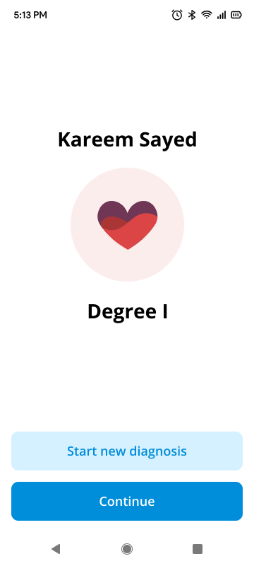

# CardiAi

CardiAi is an Android application designed to assist doctors in heart diagnosis using a machine
learning model. This app provides a comprehensive platform for managing patient information,
recording diagnostics, and ensuring secure user authentication.

## Screenshots

### Authorization

  
  
  

### Home

  
  
  
  

### Diagnosis Flow

  
  
  
  

You can find more screenshots of the app in the [Screenshots Folder](https://github.com/CardiAi/CardiAi-Android/tree/master/Screenshots)

## Features

### Authentication

* Login & Signup Pages: Secure authentication system allowing users to create accounts or log in
  securely.

### Patient Management

* **Home Page:** Displays all patients of the logged in doctor, serving as the central hub for
  accessing patient records.
* **Individual Patient Pages:** Detailed pages for each patient, showcasing their diagnosis history.
* **Patient Registration Form:** Implemented a user-friendly patient registration form to facilitate
  the addition of new patients to the system.
* **Patient Search Functionality:** Implemented a patient search feature to allow doctors to easily
  locate specific patients by their name.

### Diagnostic Management

* **Diagnostic Pages:** Pages dedicated to displaying specific diagnosis details, including
  predictions and associated data.
* **Diagnostic Creation Flow:**
    * Developed a comprehensive diagnostic creation flow to enable doctors to input and record
      diagnostic information.
    * Utilized Horizontal View Pager to implement the flow of adding a new diagnosis.

### Pagination

* Enhanced pagination functionality by leveraging the **Paging 3 library**, a powerful tool for
  managing and loading large datasets efficiently.
* Integrated Paging 3 seamlessly into the application's architecture to handle data pagination with
  ease.
* Utilized Paging 3's built-in support for handling data loading states, such as loading, error, and
  success, providing a smooth user experience.

## Technology Stack

CardiAi is built using a robust technology stack to ensure high performance and scalability:

* Kotlin
* Coroutines
* Jetpack Compose
* Compose Destinations Library
* MVVM (Model-View-ViewModel)
* DI with Hilt (Dependency Injection)
* Clean Architecture (Data - Domain - Presentation)
* Retrofit: For network operations.
* Paging 3: For efficient data pagination.

## Contributors
* <a href="https://github.com/mSaayeh" target="_blank">Mohannad El-Sayeh</a> : [eng.mohannadelsayeh@gmail.com](mailto:eng.mohannadelsayeh@gmail.com)
* <a href="https://github.com/NadinAhmed" target="_blank">Nadin Ahmed</a> : [nadinahmed316@gmail.com](mailto:nadinahmed316@gmail.com)
